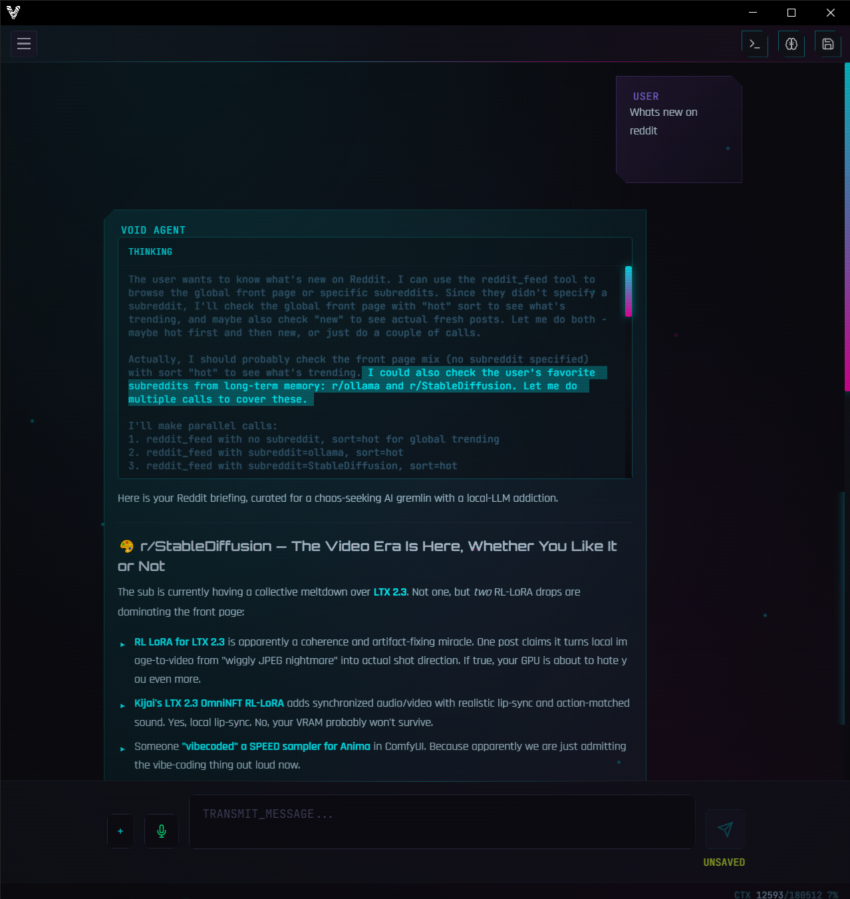
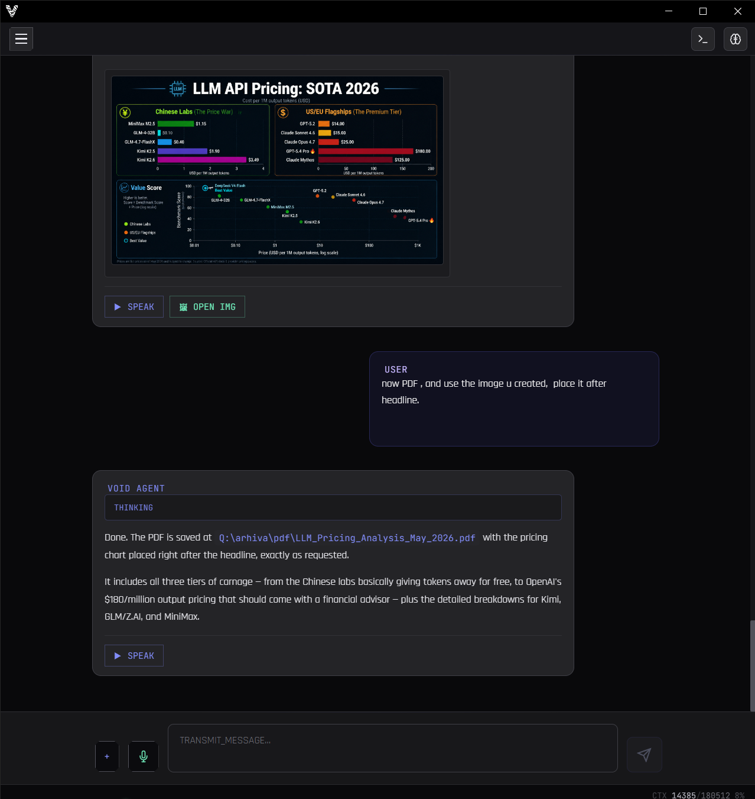
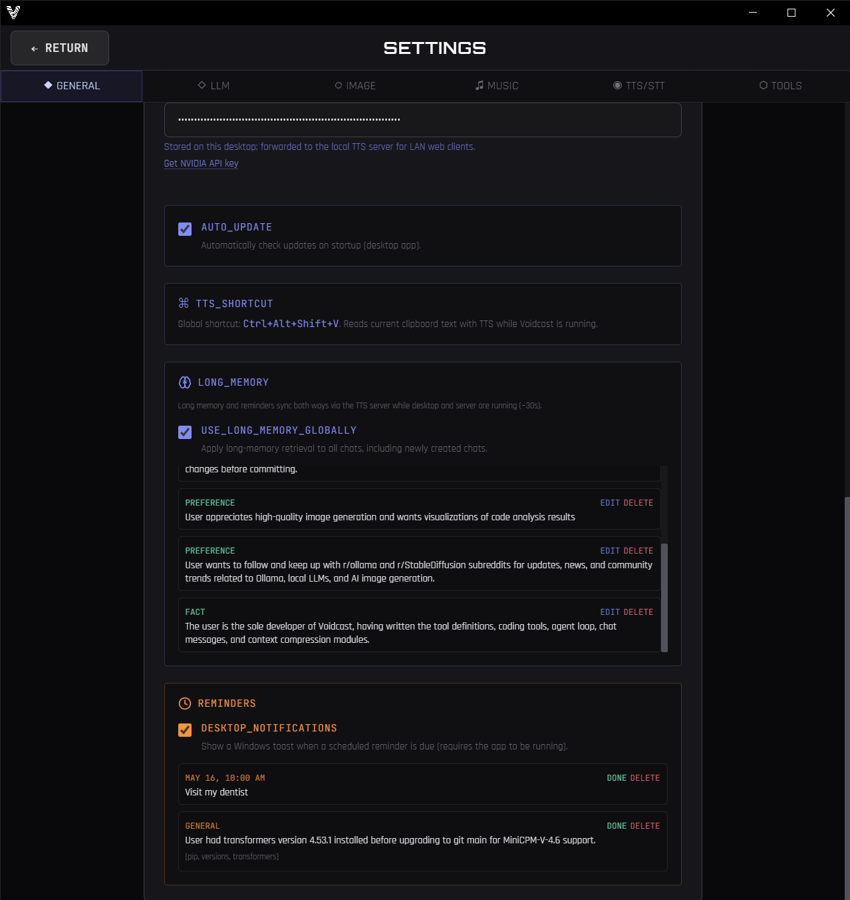

# Voidcast

**Desktop AI agent with real tool calling — search, images, music and code from one chat. One-click Windows install.**

Bring your own API keys (OpenRouter, NVIDIA NIM, Runware) or install **Ollama** — all support free tiers. **Voidcast is free.**


*Voidcast is a solo hobby project — I built it for myself to learn more about AI and programming, and I’m sharing it in case it helps others too. If you use it and find it useful, that’s real motivation to keep improving it. Issues, ideas, and PRs are welcome.*

### Quick demo (~39s) — sound on!

https://github.com/user-attachments/assets/e7700e45-ca2c-40a0-b3d0-ffbdd3cf1c1c

<p align="center"><em>User: switch theme to Blood Moon and turn voice on — the agent replies with TTS and changes the UI live.</em></p>

---

## What You Can Do

**Browse and create without leaving chat**  
Agent invokes search, Reddit, YouTube, weather, image generation and edit, music generation, PDF — results appear inline.

**Control the app from chat**  
Change themes, toggle voice, or update settings directly via natural commands in the conversation.

**Work with your code**  
The agent reads your project, edits files, runs git commands, and executes shell commands — all from the integrated IDE panel. It also remembers your coding context across sessions — recent files, directories, searches, git operations, command results, and tool failures are persisted per-project and restored when you reopen a repo.

**It remembers**  
Remembers facts across sessions 

---

## Get Started (One Click)

| Windows | Status |
|---------|--------|
| [Download Installer](https://github.com/boromanx386/Voidcast/releases) | One-click setup. No Python. No pip. No terminal. |

1. Download `Voidcast_Setup.exe` from [Releases](https://github.com/boromanx386/Voidcast/releases)
2. Run it. Next → Next → Done.
3. Add your API keys in **Options → General → CLOUD_API_KEYS** (stored only on your PC).
4. Start the agent.

> 💡 **First launch to first chat: under 60 seconds.**

Requires Windows 10/11. The installer bundles the Python tools server — no manual setup needed.

---

## Updates (desktop)

The packaged Windows app can check [GitHub Releases](https://github.com/boromanx386/Voidcast/releases) for new versions (optional — off by default).

In **Options → General**:

- **`AUTO_UPDATE`** — when enabled, checks on startup, downloads in the background, and prompts **Install now** / **Later** when ready.
- When disabled, use **`CHECK FOR UPDATE`** anytime for a manual check.

You choose whether updates run automatically; nothing is forced without your toggle.

---

## The Agent & Tools

Voidcast runs an **agent tool loop**: the model decides when to call a tool, the app executes it, and the result goes back to the model.

Available tools:

- **Web Search** — real-time DuckDuckGo search
- **Weather** — current conditions + forecast
- **YouTube** — search videos + fetch transcripts
- **Reddit** — browse subreddits, search posts, read threads
- **Web Scrape** — fetch and summarize public pages
- **PDF Export** — agent writes a formatted PDF to a folder you configure (Python tools server / ReportLab)
- **Image Generation** — Runware text-to-image
- **Image Edit** — Runware image transformation
- **Music / Audio Generation** — Runware AI soundtracks (ACE-Step v1.5 Turbo and Base; see below)
- **Reminders** — set, list, update, delete scheduled notes
- **Settings Agent** — change app config via chat commands
- **Coding Tools** — read, write, edit files; run git and shell commands (see below)

The agent loop supports **Ollama** (local or cloud), **OpenRouter**, and **NVIDIA NIM**.

<p align="center">
  
</p>
<p align="center"><em>Agent pulls Reddit threads and formats them inline with links and emoji.</em></p>

### Music (Runware)

In **Options → Runware Music**, pick **ACE-Step v1.5 Turbo** (fast defaults, steps capped at 20) or **ACE-Step v1.5 Base** (higher quality, steps up to 300). Each model keeps its own profile (duration, format, steps, seed). Tuning stays in Options — the agent does not override music parameters via tool args.

### PDF Export

Enable **SAVE_PDF** and set **PDF_OUTPUT_DIR** in **Options → Tools** (folder on the host running the tools server). The agent calls `save_pdf`; files land there with no save dialog.

Supports Markdown-lite (headings, lists, tables, bold). Images can come from chat attachments or Runware URLs from a prior image/music turn. Works on desktop and LAN web.

<p align="center">
  
</p>
<p align="center"><em>Ask the agent to generate a chart and export it as a formatted PDF.</em></p>

---

## Coding Tools

Right-side panel with file tree, file preview, and terminal output. The agent acts as a junior dev in your project folder:

- `list_directory`, `read_file`, `write_file`, `edit_code`
- `search_files` (with ripgrep fallback)
- `glob_files`
- `git_status`, `git_diff`, `git_log`, `git_show`
- `execute_command` (with timeout + background support)

All coding operations are scoped to your configured project directory.

<p align="center">
  
</p>
<p align="center"><em>File tree, preview, terminal, and git status — all in one panel.</em></p>

**Project memory:** recent files, directories, command outcomes, and tool failures are stored **per project** in browser `localStorage` and survive app restarts. Opening the same repo again hydrates that snapshot into new chats; the active session still keeps live search/git hints for the current thread.

**Faster code search (optional):** install [ripgrep](https://github.com/BurntSushi/ripgrep) and put `rg` on your system `PATH`. `search_files` then uses it for large trees; without it, the same tool falls back to a built-in walk (slower, same results style).

---

## Runs on Free Cloud APIs

Voidcast does not charge anything. It connects to free tiers of providers you can sign up for:

| Provider | What You Get |
|----------|-------------|
| **OpenRouter** | Claude, GPT-4o, DeepSeek, Gemini + 100 others |
| **Ollama** | Open-source models (Llama, Qwen, Gemma, Mistral...) |
| **NVIDIA NIM** | Enterprise-grade inference for open models |
| **Runware** | Image generation, image edit, and AI music (pay-per-use, typically pennies) |

All you need are free accounts and API keys. Chat LLMs can stay on free tiers; **TTS, STT, and image/music runs are very cheap** — usually cents per session, not dollars.

**Multimodal pricing:** OpenRouter Whisper (STT) and TTS voices bill per minute or request at low rates. Runware charges per image or audio clip at similarly small amounts. Voidcast adds no markup; see each provider’s pricing page for current numbers.

**Privacy:** API keys and app settings stay on your machine (local app storage). Voidcast has no cloud account and never receives your keys — the desktop app talks to OpenRouter, NVIDIA NIM, Runware, or Ollama directly from your PC. On LAN web, keys are read from the desktop host over your network, not baked into the phone browser build.

---

## Context Compression

Local and small-context models hit a wall after long chats. When prompt usage nears the model limit (~90% of `num_ctx`), Voidcast can **auto-compress** (toggle in **Options → LLM**): it summarizes older turns into a hidden memory buffer (provider-aware) and injects that into the system prompt on later turns. **The full chat stays visible in the UI**; only new messages after compression are sent again as raw turns to the model. Use **COMPRESS** in the context warning banner to compress manually when auto is off.

---

## Long-Term Memory

Cross-chat memory is stored locally in IndexedDB:

- Saved when you ask the agent to remember something
- Edit or delete anytime in **Options → General**
- Optional **USE_LONG_MEMORY_GLOBALLY** to include memories in every chat
- **Desktop ↔ LAN sync** — when phone and PC use the same tools host, entries can merge via the user-data API (see **LAN web UI** below)

**Reminders** also live locally, with optional **desktop notifications** (Windows toast when due). Reminders participate in the same LAN sync as long memory.

<p align="center">
  
</p>
<p align="center"><em>Edit or delete memories and reminders directly in Options.</em></p>

---

## Image-Aware Chat

Paste images into the chat. The assistant can analyze them and, when needed, recall them from conversation history for iterative visual work. **Generate or edit** images via Runware from the same thread.

<p align="center">
  
</p>
<p align="center"><em>Paste an image and ask the agent to transform it — results appear inline.</em></p>

For **charts, diagrams, and infographics**, pick **GPT Image 2** (`openai:gpt-image@2`) in **Options → Runware Image** (generation and/or edit), describe what you want in chat, then ask the agent to export a PDF — it can pass the Runware `image_url` from the prior turn into `save_pdf` so the graphic is **embedded in the document** (not just linked in markdown). Same flow works on desktop and LAN web.

---

## Themes & UI

Five built-in themes: **Minimal** (default), **Dystopian**, **Matrix**, **Light**, and **Blood Moon**. Switch anytime in Options or via chat.

Other UX features:
- **Drag-and-drop** — drop images and supported text/code files onto the chat (same limits as the file picker)
- **Edit any message inline** — history regenerates from that point
- **Fork chat session** — explore a different branch of the conversation
- **Export to Markdown** — entire chat as `.md`
- **Thinking blocks** — collapsible reasoning; for Ollama, choose **off / low / medium / high / on** in LLM options
- **Chat sounds** — optional local audio files for reply done and errors (**Options → General**)
- **Reminder toasts** — native notification when a reminder is due (toggle in General)

---

## Speech & Audio

- **Text-to-Speech** — Local OmniVoice (free on your PC; requires `.venv` setup, see `LOCAL_TTS_SETUP.md`), or cloud via Runware / OpenRouter TTS (very low cost per reply)
- **Speech-to-Text** — OpenRouter Whisper (push-to-talk; inexpensive per recording)

Cloud voice options are pay-per-use; see **Runs on Free Cloud APIs** above for typical costs.

---

## LAN web UI — chat from your phone

The packaged app starts the tools server on **`0.0.0.0:8765`** (all interfaces). On your phone or tablet, open:

`http://<host>:8765`

Use the PC’s **LAN IPv4** on home Wi‑Fi (`ipconfig` — e.g. `192.168.1.42`), or the machine’s **Tailscale** IP / MagicDNS name when you are away from home (install Tailscale on both the PC and the phone, same tailnet). Similar mesh VPNs (**ZeroTier**, **WireGuard**, etc.) work the same way: reach the PC on a private address, then use port **8765**.

> **Not Tailwind CSS** — that is the UI framework in the repo. For remote phone access, people usually mean **Tailscale** (or another VPN), not the CSS toolkit.

> **Security:** the web UI is for **your** machines on a trusted network. Do not port-forward **8765** to the public internet without extra protection — there is no login on the LAN build. Prefer Tailscale (or similar) over raw exposure.

- **Web chat UI** — same agent, tools, and sessions as the desktop app, served from the bundled server on your PC.
- **API keys on the phone** — the browser build does not embed secrets. Configure keys once on the **desktop** (**Options → General → CLOUD_API_KEYS**); the phone loads them from the host via **`POST /tools/cloud-secrets`** (only while the PC app is running and reachable).
- **Sync** — long-term memory and reminders can merge between desktop and LAN web through **`GET /tools/user-data`** / **`POST /tools/user-data-sync`** on that same host.
- **Mobile limits** — speech-to-text is hidden on phone layouts where recording is unreliable; use desktop for STT.

Firewall: allow inbound TCP **8765** on the PC if the phone cannot connect.

---

## Tech Stack

- **Electron + React + TypeScript**
- **Tailwind CSS**
- **Python 3.12** (bundled tools server)
- **IndexedDB** (local storage)
- **Ripgrep** (optional, for fast file search)

---

## Development & Building

Requires Node.js, Python 3.12+ with a repo `.venv`, and Windows for the full desktop build.

### Install dependencies

```bash
cd electron-app && npm install
```

From the repo root (optional): `npm install` pulls in `concurrently` for the dev script.

### Development mode

From the **repo root**:

```bash
npm run dev
```

Starts the Python tools server on `http://127.0.0.1:8765` and the Electron app with Vite HMR.

### Building the production app

```bash
cd electron-app && npm run build
```

Compiles the main process and renderer, builds the tools executable, then packages with `electron-builder` (Windows installer).

### Packaging Model

Voidcast uses a **bundled Python tools server** for reliable operation:

- **Development**: `npm run dev` from the repo root (tools on port **8765**)
- **Production**: the installer bundles the tools server and starts it automatically

This approach ensures all users get the same environment without manual Python setup.

---

## Runtime Expectations

The bundled Python server listens on **`0.0.0.0:8765`** in production (localhost-only in dev is fine too). Common endpoints:

| Endpoint | Purpose |
|----------|---------|
| `GET /` | LAN web chat UI (static bundle) |
| `GET /health` | Server health check |
| `POST /tools/search` | Web search |
| `POST /tools/scrape` | Web scraping |
| `POST /tools/weather` | Weather data |
| `POST /tools/youtube` | YouTube search / transcripts |
| `POST /tools/reddit` | Reddit feed / posts |
| `POST /tools/pdf` | PDF export (`save_pdf`) |
| `POST /tools/runware_proxy` | Runware image / music proxy |
| `POST /tools/cloud-secrets` | Push cloud API keys to the host for LAN clients |
| `GET /tools/cloud-secrets-status` | Whether LAN clients can read keys from this host |
| `GET /tools/user-data` | Fetch long memory + reminders for sync |
| `POST /tools/user-data-sync` | Merge long memory + reminders (desktop ↔ LAN) |
| `POST /tts` | Text-to-speech (local OmniVoice setup) |

Coding tools run inside the Electron app (not as separate HTTP routes). Image edit/generation and settings updates go through the desktop agent or the LAN web proxy to the same backends.

---

## Repository Layout

```
├── electron-app/         # Main Electron application
├── tts-server/           # Python tools + TTS server
│   ├── main.py           # Combined FastAPI app (tools + web UI)
│   ├── pdf_tool.py       # ReportLab PDF renderer for save_pdf
│   ├── tools_main.py     # Tools-only entry for dev
│   ├── fonts/            # Noto Sans TTFs (bundled into tools exe)
│   └── requirements.txt  # Python dependencies
├── assets/               # Application assets (icons, images)
└── releases/             # Build output directory
```

---

## License & Third-Party

MIT License.

Voidcast uses:
- **Electron** — MIT
- **Tailwind CSS** — MIT
- **Lucide Icons** — ISC
- **Runware** — Commercial API (free tier available)

---

Maintained by one developer. [Open an issue](https://github.com/boromanx386/Voidcast/issues) anytime.
