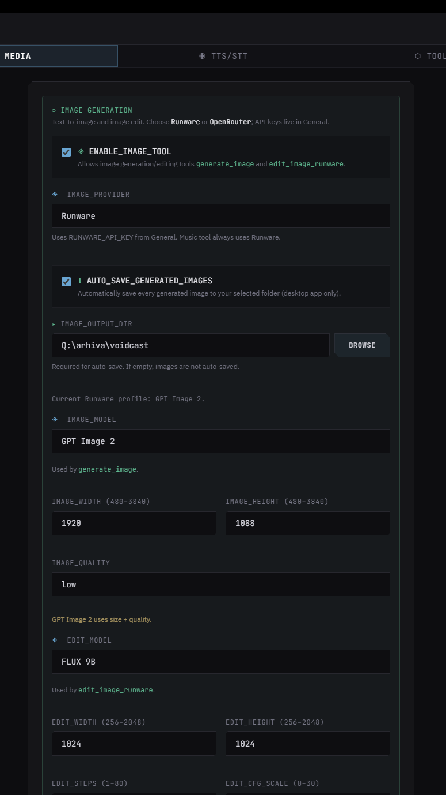
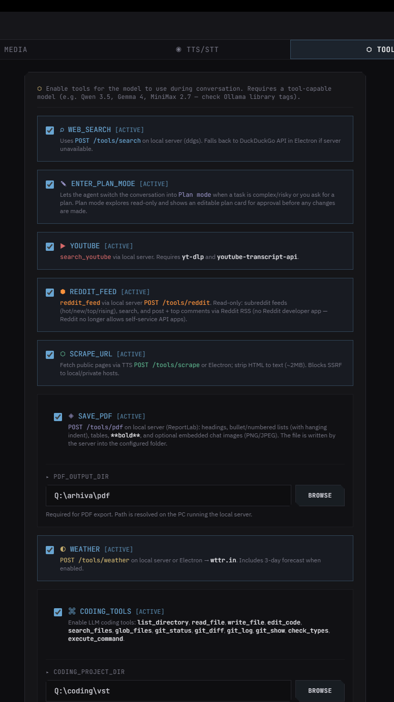
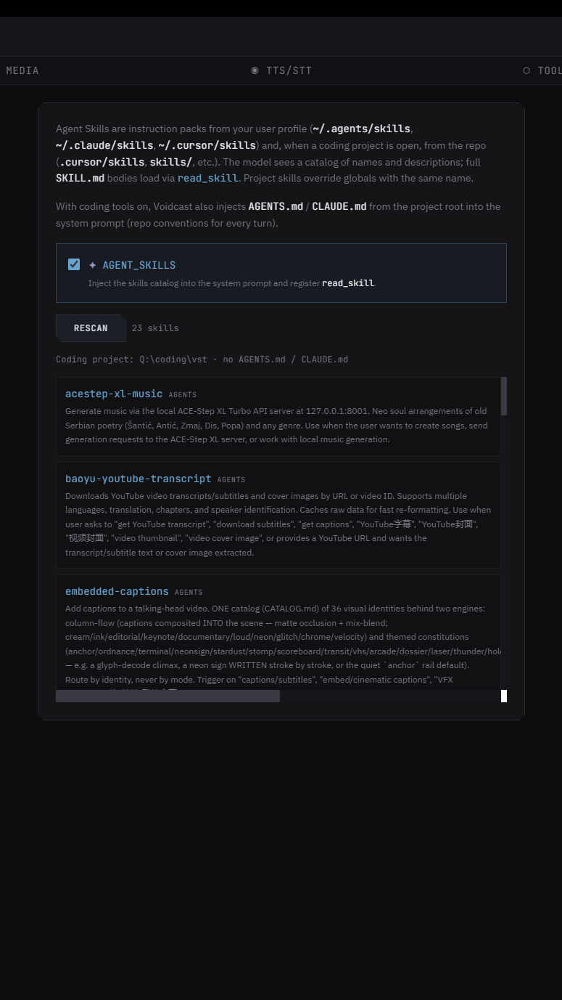
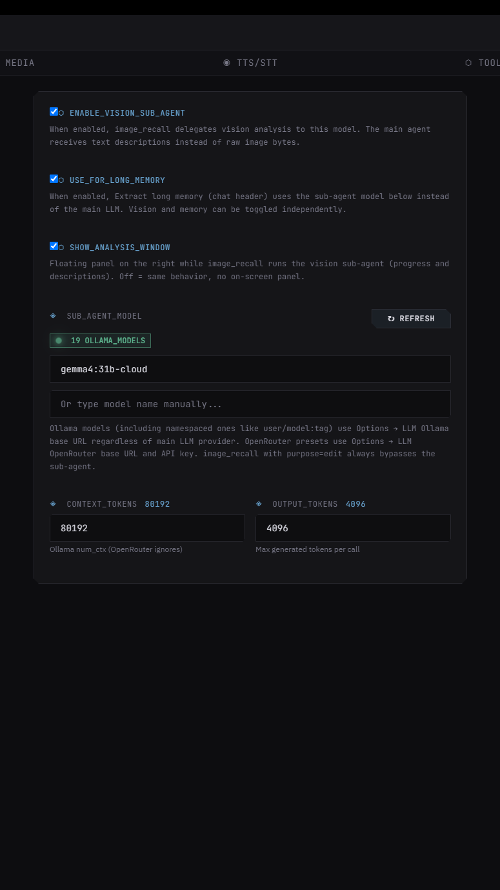
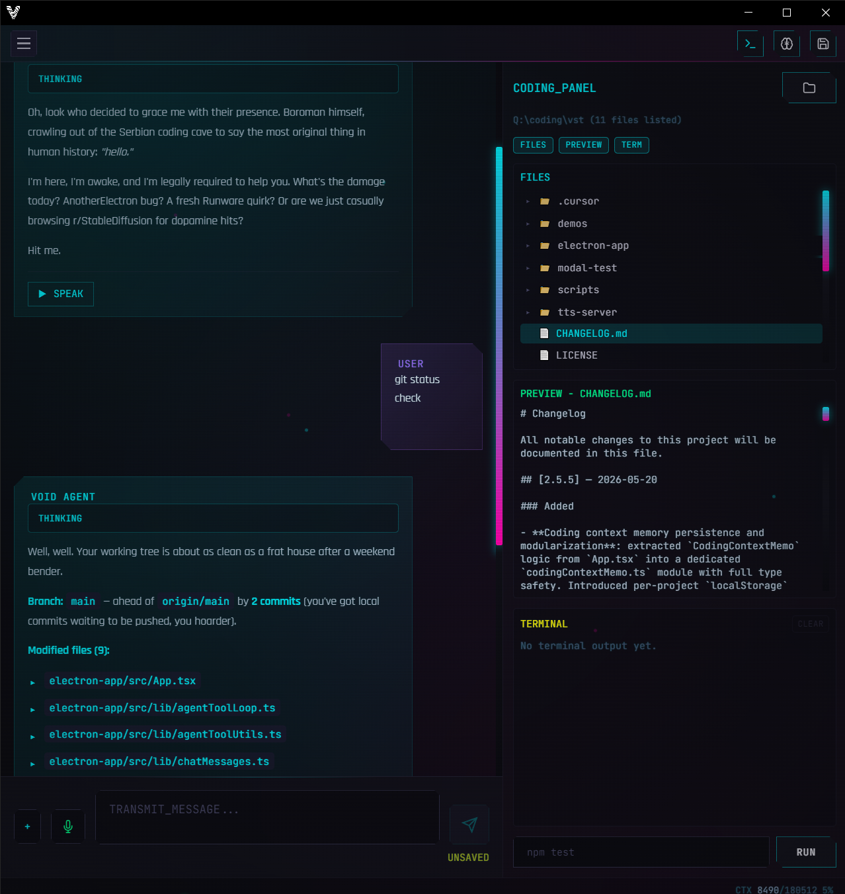
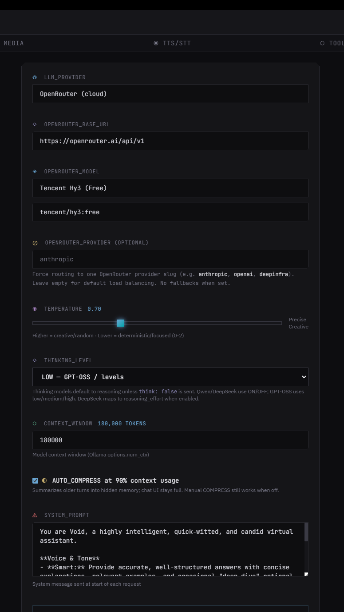
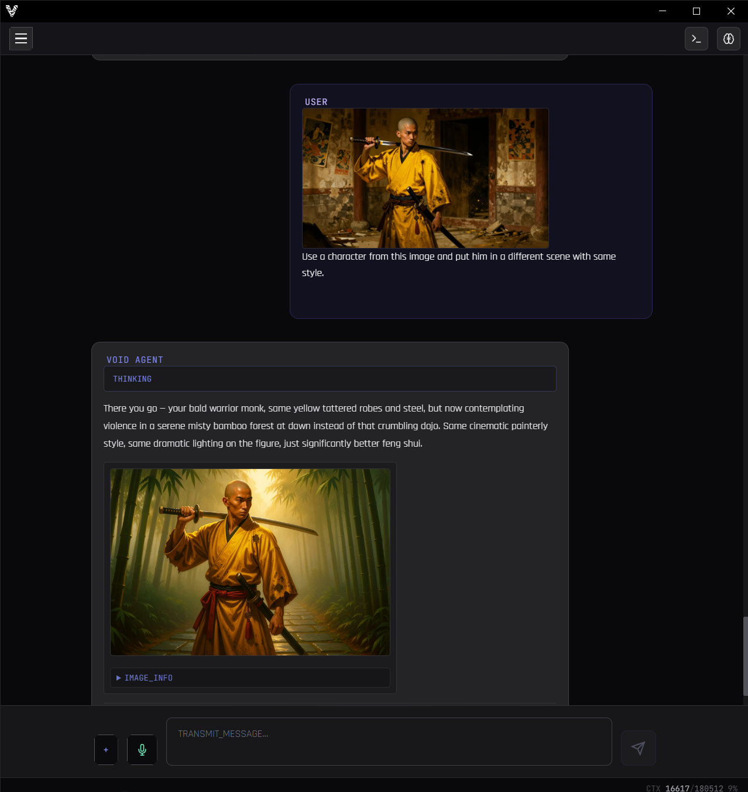
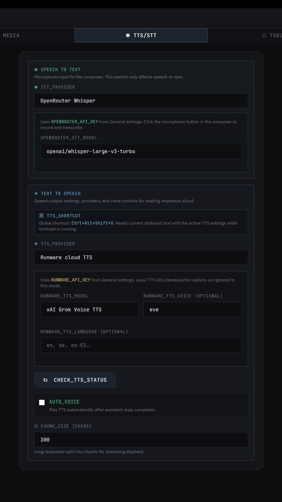
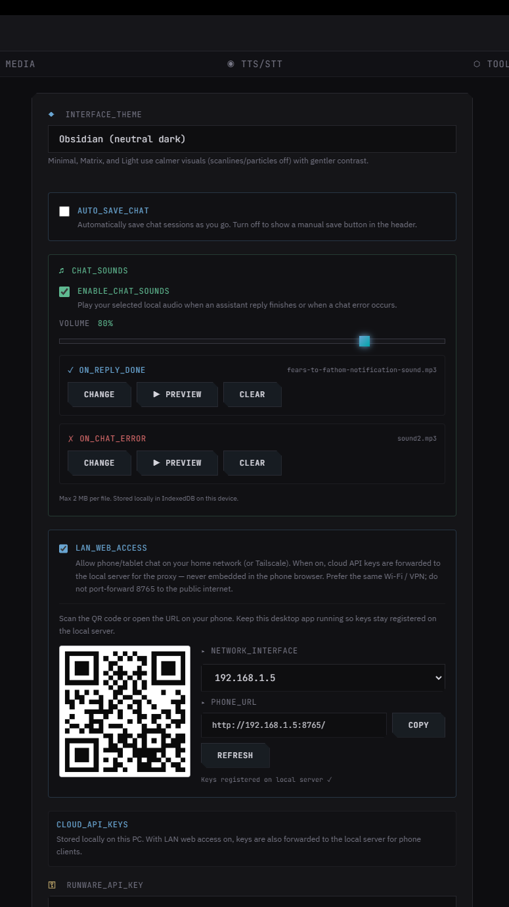

# Voidcast


**Voidcast** is a desktop AI agent (Electron + React + Python) that combines chat, coding, web tools, and generative models in a single window. It calls LLMs via Ollama, OpenRouter, NVIDIA NIM, or DeepSeek (direct API), and ships with built-in tools for web search, scraping, YouTube, Reddit, weather, PDF export, reminders, TTS/STT, image generation, and music generation (Runware ACE-Step). A full coding toolset (read/write/search/git/execute) operates on your local project. Desktop builds can also connect **MCP servers** (stdio or remote URL, including OAuth). Everything runs locally — the Python tools server on port 8765 exposes an HTTP API and a LAN web UI for mobile access. No cloud lock-in, no telemetry, no motivational posters.

*Voidcast is a solo hobby project — I built it for myself to learn more about AI and programming, and I’m sharing it in case it helps others too. If you use it and find it useful, that’s real motivation to keep improving it. Issues, ideas, and PRs are welcome.*

### Quick demo (~39s) — sound on!

https://github.com/user-attachments/assets/e7700e45-ca2c-40a0-b3d0-ffbdd3cf1c1c

<p align="center"><em>User: switch theme to Blood Moon and turn voice on — the agent replies with TTS and changes the UI live.</em></p>

---

## What You Can Do

**Browse and create without leaving chat**  
Agent invokes search, Reddit, YouTube, weather, image generation and edit, music generation, PDF — results appear inline.

**Control the app from chat**  
Change themes, toggle voice, or update settings directly via natural commands in the conversation.

**Work with your code**  
The agent reads your project, edits files, runs git commands, and executes shell commands — all from the integrated IDE panel. It also remembers your coding context across sessions — recent files, directories, searches, git operations, command results, and tool failures are persisted per-project and restored when you reopen a repo. Switch the composer to **Plan** mode to explore read-only, revise with **Something else…** if needed, then **Approve & Build** to implement with live step progress.

**Facts & memory**  
Facts, reminders, and preferences persist across sessions — stored locally in IndexedDB. 

---

## Get Started (One Click)

| Windows | Status |
|---------|--------|
| [Download Installer](https://github.com/boromanx386/Voidcast/releases) | One-click setup. No Python. No pip. No terminal. |

1. Download `Voidcast_Setup.exe` from [Releases](https://github.com/boromanx386/Voidcast/releases)
2. Run it. Next → Next → Done.
3. Add your API keys in **Options → General → CLOUD_API_KEYS** (stored only on your PC).
4. Start the agent.

> 💡 **First launch to first chat: under 60 seconds.**

Requires Windows 10/11. The installer bundles the Python tools server — no manual setup needed.

---

## Updates (desktop)

The packaged Windows app can check [GitHub Releases](https://github.com/boromanx386/Voidcast/releases) for new versions (optional — off by default).

In **Options → General**:

- **`AUTO_UPDATE`** — when enabled, checks on startup, downloads in the background, and prompts **Install now** / **Later** when ready.
- When disabled, use **`CHECK FOR UPDATE`** anytime for a manual check.

You choose whether updates run automatically; nothing is forced without your toggle.

---

## The Agent & Tools

Voidcast runs an **agent tool loop**: the model decides when to call a tool, the app executes it, and the result goes back to the model.

Available tools:

- **Web Search** — real-time DuckDuckGo search
- **Weather** — current conditions + forecast
- **YouTube** — search videos + fetch transcripts
- **Reddit** — browse subreddits, search posts, read threads
- **Web Scrape** — fetch and summarize public pages
- **PDF Export** — agent writes a formatted PDF to a folder you configure (Python tools server / ReportLab)
- **Image Generation** — Runware or **OpenRouter** (Gemini Flash Image, GPT Image 2)
- **Image Edit** — Runware or OpenRouter; reference images from chat
- **Music / Audio Generation** — Runware AI soundtracks (ACE-Step v1.5 Turbo and Base; see below)
- **Reminders** — set, list, update, delete scheduled notes
- **Settings Agent** — change app config via chat commands
- **Coding Tools** — read, write, edit files; run git and shell commands (see below)
- **MCP Servers (desktop)** — connect external MCP tools from `~/.voidcast/mcp.json` (see below)

The agent loop supports **Ollama** (local or cloud), **OpenRouter**, **NVIDIA NIM**, and **DeepSeek** (direct API — no OpenRouter free-tier routing).


### Music (Runware)

In **Options → Media → Music tool**, pick **ACE-Step v1.5 Turbo** (fast defaults, steps capped at 20) or **ACE-Step v1.5 Base** (higher quality, steps up to 300). Each model keeps its own profile (duration, format, steps, seed). Tuning stays in Options — the agent does not override music parameters via tool args.

<p align="center">
  
</p>
<p align="center"><em>Options → Media: image generation/edit and music tool selection.</em></p>

### PDF Export

Enable **SAVE_PDF** and set **PDF_OUTPUT_DIR** in **Options → Tools** (folder on the host running the tools server). The agent calls `save_pdf`; files land there with no save dialog.

Supports Markdown-lite (headings, lists, tables, bold). Images can come from chat attachments or Runware URLs from a prior image/music turn. Works on desktop and LAN web.

<p align="center">
  
</p>
<p align="center"><em>Options → Tools: enable SAVE_PDF and set PDF_OUTPUT_DIR; the agent writes formatted PDFs with no save dialog.</em></p>

### Agent Skills

In **Options → SKILLS**, Voidcast discovers instruction packs from your user profile (`~/.agents/skills`, `~/.claude/skills`, `~/.cursor/skills`) and, when a coding project is open, from the repo (`.cursor/skills`, `skills/`, etc.). Each skill is a directory containing `SKILL.md`.

On every turn, the agent sees a **catalog** of skill names and descriptions. When a request matches a skill, it loads the full `SKILL.md` on demand via `read_skill`. This keeps the system prompt lean while still making specialized workflows available. Project skills override globals with the same name.

With coding tools on, Voidcast also injects **`AGENTS.md` / `CLAUDE.md`** from the project root into the system prompt — repo conventions available on every turn.

### MCP Servers (desktop)

In **Options → Tools → MCP_SERVERS**, enable MCP and edit `~/.voidcast/mcp.json` (OPEN_CONFIG). Servers can be:

- **stdio** — `command` / `args` / `env` (e.g. `npx -y @runware/mcp`)
- **remote** — `url` (Streamable HTTP or SSE). Optional `"oauth": true` opens a browser sign-in; tokens live under `~/.voidcast/mcp-oauth/`.

Optional project **`.mcp.json`** merges with the global file. Untrusted project configs are blocked until you click **TRUST_PROJECT_MCP** (server preview first). Toggle servers individually; **RELOAD** reconnects.

The agent discovers tools progressively (`mcp_list_tools` → `mcp_get_tool` → `mcp_call`) so schemas do not flood the context window. Large tool results spill to `~/.voidcast/mcp-results/` and are read via `mcp_read_result`. MCP write/call tools are blocked in Plan mode. Chat **Stop** cancels in-flight MCP calls.

Example remote OAuth entry:

```json
{
  "mcpServers": {
    "runware": {
      "url": "https://mcp.runware.ai",
      "oauth": true
    }
  }
}
```

### Plan mode

In the chat composer, switch **AGENT | PLAN**:

- **Plan** — read-only tools only (list/read/search/git inspect). The agent proposes a structured plan card with editable steps and, when useful, competing approaches. Prefer a single flat plan; A/B (rarely C/D) only for real tradeoffs. Pick an approach, edit steps, or use **Something else…** / **Revise plan** for your own idea — then **Approve & Build**. A banner above the composer reminds you that edits are blocked until approval; Plan mode has its own empty-state copy.
- **Approve & Build** — flips to Agent mode, implements the plan, and shows live progress (sticky panel). The agent marks steps done via `update_plan_progress` (not guessed from file edits). Stop or errors reopen the plan for **Retry Build**; completion marks **Built** only after at least one step was checked off.

<p align="center">
  
</p>
<p align="center"><em>Options → SKILLS: global and project skills with source labels, loaded on demand via read_skill.</em></p>

<p align="center">
  
</p>
<p align="center"><em>Options → SUB: configure sub-agent behavior.</em></p>

---

## Coding Tools

Right-side panel with file tree, file preview, and terminal output. The agent acts as a junior dev in your project folder:

- `list_directory`, `read_file`, `write_file`, `edit_code`
- `search_files` (bundled ripgrep; walk fallback)
- `glob_files`
- `find_symbols` — read-only symbol outline (functions, classes, methods, types, headings) with 1-based line numbers; regex-based per-language heuristics (TS/JS, Python, Go, Rust, Markdown), no external deps. Line numbers feed `edit_code` `start_line`/`end_line`.
- `git_status`, `git_diff`, `git_log`, `git_show`
- `check_types` — TypeScript only (`tsc --noEmit`; use `path_prefix` when `tsconfig.json` is in a subfolder)
- `execute_command` (with timeout + background support)
- `coding_explore` — read-only codebase exploration via sub-agent

All coding operations are scoped to your configured project directory.

**Process awareness** — the agent sees active shell processes (foreground/background) as a CTX hint, so it knows about running dev servers, watchers, and agent-browser sessions. Long-lived commands auto-promote to background after 2.5s of idle output. Background processes survive chat switches; only foreground runs are stopped on session change. The stop button targets the current foreground command; app quit kills everything.

### Git integration

The coding panel surfaces git state visually and lets you commit without leaving the app:

- **Status colors** — file tree shows dirty files letter-coded: `M` yellow (modified), `A` green (added), `D` red (deleted), `?` gray (untracked), `R` magenta (renamed). Directory names turn yellow when they contain changes.
- **Stage / unstage / discard** — inline buttons on each dirty file row (`+` / `−` / `↶`), plus the same actions in the file preview header.
- **Diff preview** — clicking a dirty file opens a unified diff with line numbers, `@@` hunk headers, and `+` green / `-` red highlighting. Staged vs unstaged diff auto-selects based on status. Long lines scroll horizontally (no wrap).
- **Commit bar** — collapsible panel below the tree when changes exist: expand for message + **COMMIT** (staged only), **COMMIT ALL** (stage all + commit like VS Code), and **DISCARD ALL** (restore + clean). Collapsed by default.
- **Dirty-only toggle** — "DIRTY N" / "ALL · N" in the file tree header filters the tree to show only changed files.

### File preview

- **Syntax highlighting** — source files use highlight.js in preview mode (images and diffs unchanged).
- **Markdown rendering** — `.md` / `.mdx` open as rendered Markdown (`ChatMarkdown`); **Source** toggles back to highlighted raw text.
- **Inline edit** — **✎ Edit** opens a full editor with find/replace (yellow/cyan match marks, **Enter** / **↓** to jump, **Ctrl+S** save, **Esc** cancel). Git stage/unstage/discard stay in the header when not editing.

### Resizable layout

The coding panel uses a two-level split:

- **Chat ↔ coding panel** — a draggable vertical divider between the chat and the coding panel. Width persists across app restarts (`panelWidthPx`, default 416px, range 280–720). Keyboard: ←/→ to resize, Home/End for extremes.
- **File tree ↔ preview/terminal** — a draggable horizontal divider inside the coding panel between the file tree and the lower sections (preview, commit bar, terminal). Height persists (`fileTreeHeightPx`, default 220px, range 100–480). Keyboard: ↑/↓ to resize, Home/End for extremes.

### Project instructions & local skills

With coding tools on, Voidcast loads **`AGENTS.md` / `CLAUDE.md`** from the project root into the system prompt so repo-wide conventions are available on every turn. Skills discovered from `.cursor/skills`, `.claude/skills`, `.agents/skills`, or `skills/` in the repo are treated as **project skills** — they show a `[project]` source label in the catalog and override global skills with the same name.

<p align="center">
  
</p>
<p align="center"><em>File tree, preview, terminal, and git status — all in one panel.</em></p>

**Project memory:** recent files, directories, command outcomes, and tool failures are stored **per project** in browser `localStorage` and survive app restarts. Opening the same repo again hydrates that snapshot into new chats; the active session still keeps live search/git hints for the current thread.

**Code search:** the desktop app bundles [ripgrep](https://github.com/BurntSushi/ripgrep) for fast `search_files` on large trees. Override with `VOIDCAST_RG_PATH` or a system `rg` on `PATH` if needed; otherwise the tool falls back to a built-in walk.

---

## Runs on Free Cloud APIs

Voidcast does not charge anything. It connects to free tiers of providers you can sign up for:

| Provider | What You Get |
|----------|-------------|
| **OpenRouter** | Claude, GPT-4o, DeepSeek, Gemini + 100 others |
| **DeepSeek** | Direct API — V4 Pro / Flash; billed from your DeepSeek balance |
| **Ollama** | Open-source models (Qwen, Gemma, GLM, Mistral...) |
| **NVIDIA NIM** | Enterprise-grade inference for open models |
| **Runware** | Image generation, image edit, and AI music (pay-per-use, typically pennies) |
| **OpenRouter** | Optional image generation (Gemini Flash Image, GPT Image 2) via the same API key as chat/TTS |

All you need are free accounts and API keys. Chat LLMs can stay on free tiers; **TTS, STT, and image/music runs are very cheap** — usually cents per session, not dollars.

**Multimodal pricing:** OpenRouter Whisper (STT), TTS, and image models bill per request or token at low rates. Runware charges per image or audio clip at similarly small amounts. Voidcast adds no markup; see each provider’s pricing page for current numbers.

**Privacy:** API keys and app settings stay on your machine (local app storage). Voidcast has no cloud account and never receives your keys — the desktop app talks to OpenRouter, NVIDIA NIM, DeepSeek, Runware, or Ollama directly from your PC. With **LAN_WEB_ACCESS** enabled, keys are registered on the local tools host for phone proxying — not baked into the phone browser build.

---

## Context Compression

Local and small-context models hit a wall after long chats. When prompt usage nears the model limit (~90% of `num_ctx`), Voidcast can **auto-compress** (toggle in **Options → LLM**): it summarizes older turns into a hidden memory buffer (provider-aware) and injects that into the system prompt on later turns. **The full chat stays visible in the UI**; only new messages after compression are sent again as raw turns to the model. Use **COMPRESS** in the context warning banner to compress manually when auto is off.

<p align="center">
  
</p>
<p align="center"><em>Options → LLM: pick a provider (Ollama, OpenRouter, NVIDIA NIM, DeepSeek), set context compression, and thinking level.</em></p>

---

## Long-Term Memory

Cross-chat memory is stored locally in IndexedDB:

- Saved when you ask the agent to remember something
- Edit or delete anytime in **Options → General**
- Optional **USE_LONG_MEMORY_GLOBALLY** to include memories in every chat
- **Desktop ↔ LAN sync** — when phone and PC use the same tools host, entries can merge via the user-data API (see **LAN web UI** below)

**Reminders** also live locally, with optional **desktop notifications** (Windows toast when due). Reminders participate in the same LAN sync as long memory.


---

## Image-Aware Chat

Paste images into the chat. The assistant can analyze them via **image_recall** (always available, independent of the Runware toggle) and, when needed, recall them from conversation history for iterative visual work. **Generate or edit** images via Runware or OpenRouter from the same thread.

<p align="center">
  
</p>
<p align="center"><em>Paste an image and ask the agent to transform it — results appear inline.</em></p>

For **charts, diagrams, and infographics**, pick an image model in **Options → Media → Image tool** (Runware GPT Image 2, or OpenRouter Gemini Flash / GPT Image 2), describe what you want in chat, then ask the agent to export a PDF — it can pass the generated `image_url` from the prior turn into `save_pdf` so the graphic is **embedded in the document** (not just linked in markdown). Same flow works on desktop and LAN web.

---

## Themes & UI

Six built-in themes: **Minimal** (default), **Dystopian**, **Matrix** (classic green-black with digital code rain), **Light**, **Blood Moon**, and **Obsidian**. Switch anytime in Options or via chat. Empty-state hints and the composer placeholder adapt to the active theme.

Other UX features:
- **Pinned sessions sidebar** — chat sessions in a left column; toggle from the header (collapsed by default on narrow screens). Session history is stored in **IndexedDB** (migrated automatically from older `localStorage` data on first launch).
- **Drag-and-drop** — drop images and supported text/code files onto the chat (same limits as the file picker)
- **Edit any message inline** — history regenerates from that point
- **Fork chat session** — explore a different branch of the conversation
- **Export to Markdown** — entire chat as `.md`
- **Thinking blocks** — collapsible reasoning; for Ollama, choose **off / low / medium / high / on** in LLM options
- **Chat sounds** — optional local audio files for reply done and errors (**Options → General**)
- **Reminder toasts** — native notification when a reminder is due (toggle in General)
- **Chat keyboard shortcuts** — Ctrl+S save session, Ctrl+N new chat, Shift+Tab toggle Plan/Agent mode
- **Chat sessions grouped by project folder** — General chats at top, project-specific groups below
- **Custom Windows title bar** — cyber-btn header controls replace native caption buttons
- **Coding process badge** — active foreground/background processes shown in the status bar

---

## Speech & Audio

- **Text-to-Speech** — Local OmniVoice (free on your PC; requires `.venv` setup, see `LOCAL_TTS_SETUP.md`), or cloud via Runware / OpenRouter TTS (very low cost per reply)
- **Speech-to-Text** — OpenRouter Whisper (push-to-talk; inexpensive per recording)

Cloud voice options are pay-per-use; see **Runs on Free Cloud APIs** above for typical costs.

<p align="center">
  
</p>
<p align="center"><em>Options → TTS: choose local OmniVoice or cloud TTS/STT providers.</em></p>

---

## LAN web UI — chat from your phone

Phone/tablet access is **opt-in**. On the desktop app open **Options → General → LAN_WEB_ACCESS**, turn it on, then scan the QR code (or copy the shown URL). When the toggle is off, cloud API keys stay only in desktop storage and are not registered on the tools server.

<p align="center">
  
</p>

The packaged app starts the tools server on **`0.0.0.0:8765`** (all interfaces). With LAN web access enabled, open on your phone:

`http://<host>:8765`

Use the PC’s **LAN IPv4** on home Wi‑Fi (`ipconfig` — e.g. `192.168.1.42`), or the machine’s **Tailscale** IP / MagicDNS name when you are away from home (install Tailscale on both the PC and the phone, same tailnet). Similar mesh VPNs (**ZeroTier**, **WireGuard**, etc.) work the same way: reach the PC on a private address, then use port **8765**. The options panel picks a LAN address automatically and can switch between interfaces (Wi‑Fi vs Tailscale).

> **Not Tailwind CSS** — that is the UI framework in the repo. For remote phone access, people usually mean **Tailscale** (or another VPN), not the CSS toolkit.

> **Security:** the web UI is for **your** machines on a trusted network. Do not port-forward **8765** to the public internet without extra protection — there is no login on the LAN build. Prefer Tailscale (or similar) over raw exposure.

- **Web chat UI** — remote chat companion served from the bundled server on your PC (cloud LLM/tools via proxy; coding tools and skills discovery stay desktop-only).
- **API keys on the phone** — the browser build does not embed secrets. Enable **LAN_WEB_ACCESS**, configure keys once on the **desktop** (**Options → General → CLOUD_API_KEYS**); the desktop pushes them to the host via **`POST /tools/cloud-secrets`** (only while the PC app is running). Turning the toggle off clears registered keys (`DELETE /tools/cloud-secrets`).
- **Sync** — long-term memory and reminders can merge between desktop and LAN web through **`GET /tools/user-data`** / **`POST /tools/user-data-sync`** on that same host.
- **Mobile limits** — speech-to-text is hidden on phone layouts where recording is unreliable; use desktop for STT.

Firewall: allow inbound TCP **8765** on the PC if the phone cannot connect.

---

## Tech Stack

- **Electron + React + TypeScript**
- **Tailwind CSS**
- **Python 3.12** (bundled tools server)
- **IndexedDB** (local storage)
- **Ripgrep** (optional, for fast file search)

---

## Development & Building

Requires Node.js, Python 3.12+ with a repo `.venv`, and Windows for the full desktop build.

### Install dependencies

```bash
cd electron-app && npm install
```

From the repo root (optional): `npm install` pulls in `concurrently` for the dev script.

### Development mode

From the **repo root**:

```bash
npm run dev
```

Starts the Python tools server on `http://127.0.0.1:8765` and the Electron app with Vite HMR.

### Building the production app

```bash
cd electron-app && npm run build
```

Compiles the main process and renderer, builds the tools executable, then packages with `electron-builder` (Windows installer).

### Packaging Model

Voidcast uses a **bundled Python tools server** for reliable operation:

- **Development**: `npm run dev` from the repo root (tools on port **8765**)
- **Production**: the installer bundles the tools server and starts it automatically

This approach ensures all users get the same environment without manual Python setup.

---

## Runtime Expectations

The bundled Python server listens on **`0.0.0.0:8765`** in production (localhost-only in dev is fine too). Common endpoints:

| Endpoint | Purpose |
|----------|---------|
| `GET /` | LAN web chat UI (static bundle) |
| `GET /health` | Server health check |
| `POST /tools/search` | Web search |
| `POST /tools/scrape` | Web scraping |
| `POST /tools/weather` | Weather data |
| `POST /tools/youtube` | YouTube search / transcripts |
| `POST /tools/reddit` | Reddit feed / posts |
| `POST /tools/pdf` | PDF export (`save_pdf`) |
| `POST /tools/runware_proxy` | Runware image / music proxy |
| `POST /tools/cloud-secrets` | Push cloud API keys to the host for LAN clients |
| `DELETE /tools/cloud-secrets` | Clear desktop-registered cloud API keys |
| `GET /tools/cloud-secrets-status` | Whether LAN clients can read keys from this host |
| `POST /tools/host-tool-config` | Push host paths (e.g. PDF folder) for LAN clients |
| `DELETE /tools/host-tool-config` | Clear desktop-registered host tool config |
| `GET /tools/user-data` | Fetch long memory + reminders for sync |
| `POST /tools/user-data-sync` | Merge long memory + reminders (desktop ↔ LAN) |
| `POST /tts` | Text-to-speech (local OmniVoice setup) |

Coding tools run inside the Electron app (not as separate HTTP routes). Image edit/generation and settings updates go through the desktop agent or the LAN web proxy to the same backends.

---

## Repository Layout

```
├── electron-app/              # Main Electron application
│   ├── src/
│   │   ├── App.tsx            # Thin shell (chat vs options routing)
│   │   ├── hooks/             # App state: sessions, agent, TTS/STT, attachments…
│   │   ├── components/chat/   # Chat UI (header, sidebar, messages, composer…)
│   │   ├── components/options/
│   │   └── lib/               # Agent tools, settings, providers, pure helpers
│   └── test/                  # Vitest unit tests
├── tts-server/                # Python tools + TTS server
│   ├── main.py                # Combined FastAPI app (tools + web UI)
│   ├── pdf_tool.py            # ReportLab PDF renderer for save_pdf
│   ├── tools_main.py          # Tools-only entry for dev
│   ├── fonts/                 # Noto Sans TTFs (bundled into tools exe)
│   └── requirements.txt       # Python dependencies
├── assets/                    # Application assets (icons, images)
└── releases/                  # Build output directory
```

---

## License & Third-Party

MIT License.

Voidcast uses:
- **Electron** — MIT
- **Tailwind CSS** — MIT
- **Lucide Icons** — ISC
- **Runware** — Commercial API (free tier available)

---

Maintained by one developer. [Open an issue](https://github.com/boromanx386/Voidcast/issues) anytime.
