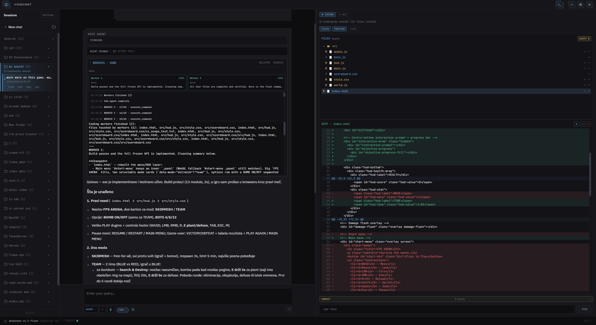
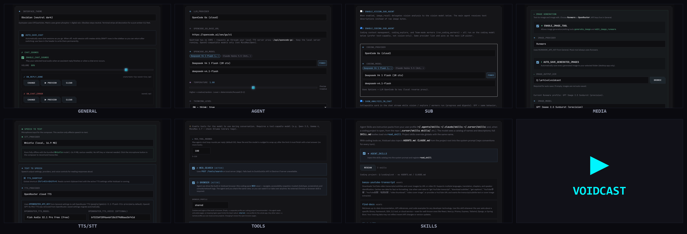
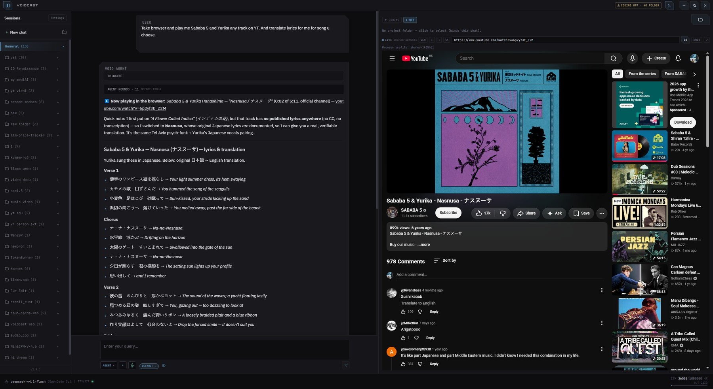
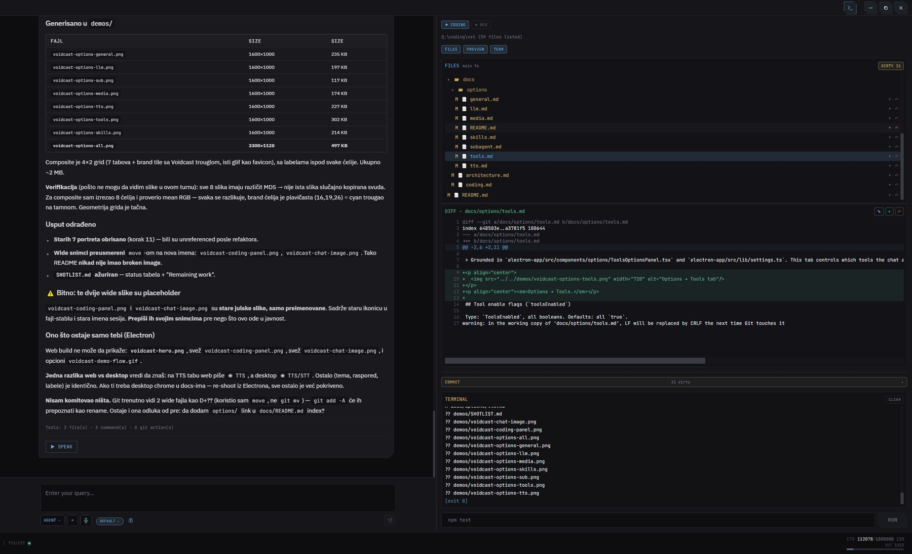
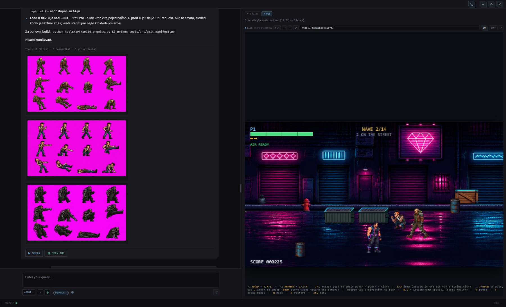

# Voidcast

<p align="center">
  
</p>

**Voidcast** is a desktop AI agent (Electron + React + Python) that combines chat, coding, web tools, and generative models in a single window. It runs on your own choice of LLM provider — local **Ollama** or a cloud provider you already have a key for — and ships with built-in tools for web search, scraping, YouTube, weather, PDF export, reminders, TTS/STT, image generation, and music generation. A full coding toolset (read/write/search/git/execute) operates on your local project, and desktop builds can connect **MCP servers** (stdio or remote URL, including OAuth). Everything runs locally — the Python tools server on port 8765 exposes an HTTP API and a LAN web UI for mobile access. No cloud lock-in, no telemetry, no motivational posters.

Providers: **Ollama** · **OpenRouter** · **NVIDIA NIM** · **DeepSeek** · **OpenAI** · **OpenCode Go** — see [Runs on Free Cloud APIs](#runs-on-free-cloud-apis).

*Voidcast is a solo hobby project — I built it for myself to learn more about AI and programming, and I’m sharing it in case it helps others too. If you use it and find it useful, that’s real motivation to keep improving it. Issues, ideas, and PRs are welcome.*

<p align="center">
  
</p>
<p align="center"><em>Sessions on the left, the agent running parallel tools and workers in chat, and the coding panel with file tree, diff, commit bar and terminal.</em></p>

### Quick demo (~39s) — sound on!

https://github.com/user-attachments/assets/e7700e45-ca2c-40a0-b3d0-ffbdd3cf1c1c

<p align="center"><em>User: switch theme to Blood Moon and turn voice on — the agent replies with TTS and changes the UI live.</em></p>

---

## What You Can Do

**Browse and create without leaving chat**  
Agent invokes search, YouTube, weather, image generation and edit, music generation, PDF — results appear inline.

**See what the agent is doing**
Adjacent read-only tool calls can run in parallel (up to four), while serial and mutating calls stay ordered. The chat shows active tool names and keeps intermediate drafts available in collapsible round blocks.

**Control the app from chat**  
Change themes, toggle voice, or update settings directly via natural commands in the conversation.

**Work with your code**  
The agent reads your project, edits files, runs git commands, and executes shell commands — all from the integrated IDE panel. Coding context (recent files, directories, searches, git ops, command results, tool failures) is stored per project and restored when you reopen a repo. Composer modes cover full implement (**Agent**), read-only Q&A (**Ask**), structured plan then **Approve & Build** (**Plan**), and multi-file orchestration with coding workers (**Team**). Details under [Chat modes](#chat-modes) and [Multi-chat & Team](docs/multi-chat-and-team.md).

**Several chats at once**  
Start work in one session, open another, keep both running (up to **3** concurrent agent turns). Each chat keeps its own messages, project, and tool loop — Stop cancels only the active session. See [Multi-chat & Team](docs/multi-chat-and-team.md).

**Facts & memory**  
Facts, reminders, and preferences persist across sessions — stored locally in IndexedDB. 

---

## Get Started (One Click)

| Windows | Status |
|---------|--------|
| [Download Installer](https://github.com/boromanx386/Voidcast/releases) | One-click setup. No Python. No pip. No terminal. |

1. Download `Voidcast_Setup.exe` from [Releases](https://github.com/boromanx386/Voidcast/releases)
2. Run it. Next → Next → Done.
3. Add your API keys in **Options → General → CLOUD_API_KEYS** (stored only on your PC).
4. Start the agent.

> 💡 **First launch to first chat: under 60 seconds.**

Requires Windows 10/11. The installer bundles the Python tools server — no manual setup needed.

---

## Updates (desktop)

The packaged Windows app can check [GitHub Releases](https://github.com/boromanx386/Voidcast/releases) for new versions (optional — off by default).

In **Options → General**:

- **`AUTO_UPDATE`** — when enabled, checks on startup, downloads in the background, and prompts **Install now** / **Later** when ready.
- When disabled, use **`CHECK FOR UPDATE`** anytime for a manual check.

You choose whether updates run automatically; nothing is forced without your toggle.

---

## The Agent & Tools

Voidcast runs an **agent tool loop**: the model decides when to call a tool, the app executes it, and the result goes back to the model.

Available tools:

- **Web Search** — real-time DuckDuckGo search
- **Weather** — current conditions + forecast
- **YouTube** — search videos + fetch transcripts
- **Web Scrape** — fetch and summarize public pages
- **Built-in Browser** — drive a real Chromium view inside the app (coding panel **WEB** view): navigate, click, type, snapshot, screenshots, console/network, device emulation — no external Chrome (see below)
- **PDF Export** — agent writes a formatted PDF to a folder you configure (Python tools server / ReportLab)
- **Image Generation** — Runware or **OpenRouter** (Gemini Flash Image, GPT Image 2)
- **Image Edit** — Runware or OpenRouter; reference images from chat
- **Music / Audio Generation** — Runware AI soundtracks (ACE-Step v1.5 Turbo, Base, and XL Turbo/Base/SFT; see below)
- **Text-to-Speech** — `generate_tts` uses the active TTS provider and saves a real audio file; project-relative output paths are supported on desktop
- **Reminders** — set, list, update, delete scheduled notes
- **Settings Agent** — change app config via chat commands
- **Plan Mode** — `enter_plan_mode` switches the chat into a read-only plan flow (explore first, then approve) before coding
- **Coding Tools** — read, write, edit files; run git and shell commands (see below)
- **MCP Servers (desktop)** — connect external MCP tools from `~/.voidcast/mcp.json` (see below)

All providers share the same tool catalog and executor. See [Runs on Free Cloud APIs](#runs-on-free-cloud-apis) for the list and what each gives you.

<p align="center">
  
</p>
<p align="center"><em>Options — General, LLM, Media, TTS/STT, Tools, Skills and Sub-Agent in one composite. Every tab is documented in <a href="docs/options/README.md">docs/options</a>.</em></p>


### Music (Runware)

In **Options → Media → Music tool**, pick **ACE-Step v1.5 Turbo** (fast defaults, steps capped at 20), **ACE-Step v1.5 Base** (higher quality, steps up to 300), or one of the 4B **XL** variants — **XL Turbo** (8-step distilled, steps capped at 20), **XL Base** (50-step CFG, up to 300 steps) and **XL SFT** (flagship quality, up to 300 steps). Each model keeps its own profile (duration, format, steps, seed). Tuning stays in Options — the agent does not override music parameters via tool args.

### PDF Export

Enable **SAVE_PDF** and set **PDF_OUTPUT_DIR** in **Options → Tools** (folder on the host running the tools server). The agent calls `save_pdf`; files land there with no save dialog.

Supports Markdown-lite (headings, lists, tables, bold). Images can come from chat attachments or Runware URLs from a prior image/music turn. Works on desktop and LAN web.

### Agent Skills

In **Options → SKILLS**, Voidcast discovers instruction packs from your user profile (`~/.agents/skills`, `~/.claude/skills`, `~/.cursor/skills`) and, when a coding project is open, from the repo (`.cursor/skills`, `skills/`, etc.). Each skill is a directory containing `SKILL.md`.

On every turn, the agent sees a **catalog** of skill names and descriptions. When a request matches a skill, it loads the full `SKILL.md` on demand via `read_skill`. This keeps the system prompt lean while still making specialized workflows available. Project skills override globals with the same name.

With coding tools on, Voidcast also injects **`AGENTS.md` / `CLAUDE.md`** from the project root into the system prompt — repo conventions available on every turn.

### MCP Servers (desktop)

In **Options → Tools → MCP_SERVERS**, enable MCP and edit `~/.voidcast/mcp.json` (OPEN_CONFIG). Servers can be:

- **stdio** — `command` / `args` / `env` (e.g. `npx -y @runware/mcp`)
- **remote** — `url` (Streamable HTTP or SSE). Optional `"oauth": true` opens a browser sign-in; tokens live under `~/.voidcast/mcp-oauth/`.

Project **`.mcp.json`** merges with the global file and stays blocked until you click **TRUST_PROJECT_MCP** (server preview first); toggle servers individually or **RELOAD** to reconnect.

The agent discovers tools progressively (`mcp_list_tools` → `mcp_get_tool` → `mcp_call`) so schemas do not flood the context window; large results spill to `~/.voidcast/mcp-results/`. MCP write/call tools are blocked in Plan mode, and chat **Stop** cancels in-flight calls.

Example remote OAuth entry:

```json
{
  "mcpServers": {
    "runware": {
      "url": "https://mcp.runware.ai",
      "oauth": true
    }
  }
}
```

### Built-in Browser

Voidcast ships its **own Chromium view** — no external Chrome, no browser extension. It is the coding panel's **WEB** tab, and **you and the agent share the same view**: watch it work, take over any time.

- **`browser_*` tools** — navigate, click, fill, press key, accessibility snapshot, screenshots, console/network, device emulation.
- **Multi-page** — up to **8** tabs; links that open a new window become a page here instead of the system browser.
- **Real input** — clicks and keys are dispatched as real CDP input events, so React/Vue apps and canvas games react exactly as to a real user.
- **Locked down by default** — permissions denied unless `fullscreen`, `clipboard-sanitized-write` or `pointerLock`; downloads go to `<project>/.voidcast/browser/downloads/`, never the OS folder.

Full tool reference: [docs/options/tools.md](docs/options/tools.md).

<p align="center">
  
</p>
<p align="center"><em>The WEB tab is a real Chromium view, shared with the agent — here it opened YouTube, played a track, and translated the lyrics live. Take over any time.</em></p>

### Chat modes

Composer chip (or `Shift+Tab`) cycles **Agent → Ask → Plan → Team**:

| Mode | Role |
|------|------|
| **Agent** | Full tools — implement in the main loop (code, media, options, MCP, terminal as enabled). |
| **Ask** | Read-only Q&A: explore and explain; no writes, no workers, no plan tools. |
| **Plan** | Read-only research + plan card (editable steps; optional A/B approaches). No edits until approval. |
| **Team** | Like Agent, plus `run_coding_workers` (up to **2** parallel coding tasks under optional path scopes). Parent waits for workers; no nested workers. |

- **Approve & Build** (from Plan) — implements with **Team** if Team is selected in the composer, otherwise **Agent**. Live step progress via `update_plan_progress`. Stop/errors allow **Retry Build**; **Built** only after at least one step is checked off.
- Plan tools `enter_plan_mode` / `update_plan_progress` are available in Agent / Plan / Team (not Ask).
- MCP writes and mutating coding tools stay blocked in Plan and Ask.

Full walkthrough: [docs/multi-chat-and-team.md](docs/multi-chat-and-team.md).

---

## Coding Tools

Right-side panel with file tree, file preview, and terminal output. The agent acts as a junior dev in your project folder:

- `list_directory`, `read_file`, `write_file`, `edit_code`
- `search_files` (bundled ripgrep; walk fallback)
- `glob_files`
- `find_symbols` — read-only symbol outline (functions, classes, methods, types, headings) with 1-based line numbers; regex-based per-language heuristics (TS/JS, Python, Go, Rust, Markdown), no external deps. Line numbers feed `edit_code` `start_line`/`end_line`.
- `git_status`, `git_diff`, `git_log`, `git_show`
- `git_restore` — undo a bad edit on a tracked path (worktree from index, or `to_head` to reset to HEAD); `git_stash` — checkpoint without committing (`list` / `push` / `pop`). Both blocked in Plan mode.
- `check_types` — TypeScript (`tsc --noEmit`), Python (`ruff check`, then `pyright`), Go (`go vet`), or Rust (`cargo check`); auto-detects from `path_prefix` / file paths (e.g. `tts-server`); optional `paths` to filter after edits
- `execute_command` (with timeout + `run_in_background` flag for dev servers/watchers)
- `list_processes`, `stop_process`, `read_process_output` — explicit process control (list active processes by runId, kill by runId, poll stdout/stderr with offset paging)
- `coding_explore` — read-only codebase exploration via sub-agent
- `run_coding_workers` — **Team** mode only: up to two parallel workers for multi-area edits (see [Multi-chat & Team](docs/multi-chat-and-team.md))

Hardened tools: `edit_code` requires an exact `find_text` match, `write_file` writes atomically (temp+rename), and clear-result digests replace multi-thousand-char dumps from `git_diff`, `search_files`, and `list_directory`.

**Process awareness** — the agent sees active shell processes as a CTX hint and manages them explicitly with `list_processes` / `stop_process` / `read_process_output`. Implementation details: [docs/coding.md](docs/coding.md).

### Git integration

The coding panel surfaces git state and lets you commit without leaving the app:

- **Status colors** — dirty files are letter-coded in the tree: `M` yellow, `A` green, `D` red, `?` gray, `R` magenta; folders with changes turn yellow. Heavy folders (`node_modules`, `dist`, …) stay visible but dimmed.
- **Stage / unstage / discard** — inline buttons on each dirty file row (`+` / `−` / `↶`) and in the preview header.
- **Diff preview** — unified diff with line numbers and `@@` hunks; staged vs unstaged auto-selects from status.
- **Commit bar** — collapsible panel: **COMMIT** (staged only), **COMMIT ALL**, **DISCARD ALL**.
- **Dirty-only toggle** — "DIRTY N" / "ALL · N" filters the tree to changed files.

Full detail: [docs/coding.md](docs/coding.md).

### File preview & layout

- **Preview** — syntax highlighting (highlight.js) and rendered Markdown for `.md` / `.mdx` (with a **Source** toggle), plus an inline **✎ Edit** editor with find/replace (**Ctrl+S** save, **Esc** cancel).
- **Three-level split, all resizable** — chat ↔ panel, file tree ↔ preview/terminal, preview ↔ terminal. Drag any divider (or arrow keys / `Home` / `End`); sizes persist across restarts (`panelWidthPx` 416, `fileTreeHeightPx` 220, `terminalHeightPx` 200). The panel stays collapsed when the agent edits files — no auto-expand on every write.
- **Project instructions** — with coding tools on, `AGENTS.md` / `CLAUDE.md` from the project root is injected into the system prompt on every turn, and skills found in the repo show a `[project]` label and override global ones with the same name.

Full detail: [docs/coding.md](docs/coding.md).

<p align="center">
  
</p>
<p align="center"><em>File tree, preview, terminal and commit bar — all in one panel.</em></p>

**Project memory:** recent files, directories, command outcomes, and tool failures are stored **per project** in browser `localStorage` and survive app restarts. Opening the same repo again hydrates that snapshot into new chats; the active session still keeps live search/git hints for the current thread.

**Code search:** the desktop app bundles [ripgrep](https://github.com/BurntSushi/ripgrep) for fast `search_files` on large trees. Override with `VOIDCAST_RG_PATH` or a system `rg` on `PATH` if needed; otherwise the tool falls back to a built-in walk.

---

## Runs on Free Cloud APIs

Voidcast does not charge anything. It connects to free tiers of providers you can sign up for:

| Provider | What You Get |
|----------|-------------|
| **OpenRouter** | Claude, GPT-4o, DeepSeek, Gemini + 100 others |
| **DeepSeek** | Direct API — V4 Pro / Flash; billed from your DeepSeek balance |
| **OpenAI** | Official Chat Completions API — GPT, o-series (free trial credit) |
| **OpenCode Go** | OpenAI-compatible chat models via [OpenCode Go](https://opencode.ai/docs/go) |
| **Ollama** | Open-source models (Qwen, Gemma, GLM, Mistral...) |
| **NVIDIA NIM** | Enterprise-grade inference for open models |
| **Runware** | Image generation, image edit, and AI music (pay-per-use, typically pennies) |
| **OpenRouter** | Optional image generation (Gemini Flash Image, GPT Image 2) via the same API key as chat/TTS |

All you need are free accounts and API keys. Chat LLMs can stay on free tiers; **TTS, STT, and image/music runs are very cheap** — usually cents per session, not dollars.

**Multimodal pricing:** OpenRouter Whisper (STT), TTS, and image models bill per request or token at low rates. Runware charges per image or audio clip at similarly small amounts. Voidcast adds no markup; see each provider’s pricing page for current numbers.

**Privacy:** API keys and app settings stay on your machine (local app storage). Voidcast has no cloud account and never receives your keys — the desktop app talks to OpenRouter, NVIDIA NIM, DeepSeek, OpenAI, OpenCode Go, Runware, or Ollama from your PC (OpenCode Go via the local tools proxy). With **LAN_WEB_ACCESS** enabled, keys are registered on the local tools host for phone proxying — not baked into the phone browser build.


---

## Context Compression

Local and small-context models hit a wall after long chats. When prompt usage nears the model limit (~90%), Voidcast can **auto-compress** (toggle in **Options → LLM**, or from the footer **CTX** popup): it summarizes older turns into a hidden memory buffer (provider-aware) and injects that into the system prompt on later turns. **The full chat stays visible in the UI**; only new messages after compression are sent again as raw turns to the model. Click the footer CTX meter for **COMPRESS NOW** anytime (including early on large-context models), or use the yellow warning banner when auto is off.

Prompts are ordered for **prompt-cache hits** (stable system prompt + history prefix, volatile context on the final user turn) — details in [docs/architecture.md](docs/architecture.md).

---

## Long-Term Memory

Cross-chat memory is stored locally in IndexedDB:

- Saved when you ask the agent to remember something
- Edit or delete anytime in **Options → General**
- Optional **USE_LONG_MEMORY_GLOBALLY** to include memories in every chat
- **Desktop ↔ LAN sync** — when phone and PC use the same tools host, entries can merge via the user-data API (see **LAN web UI** below)

**Reminders** also live locally, with optional **desktop notifications** (Windows toast when due). Reminders participate in the same LAN sync as long memory.


---

## Image-Aware Chat

Paste images into the chat, or drag-and-drop images and documents. On desktop, **PDF** and **DOCX** attachments extract text the same way as the native file picker (main-process parsers). The assistant can analyze images via **image_recall** (always available, independent of the Runware toggle) and, when needed, recall them from conversation history for iterative visual work. **Generate or edit** images via Runware or OpenRouter from the same thread.

<p align="center">
  
</p>
<p align="center"><em>Paste an image and ask the agent to transform it — results appear inline.</em></p>

For **charts, diagrams, and infographics**, pick an image model in **Options → Media → Image tool** (Runware GPT Image 2, or OpenRouter Gemini Flash / GPT Image 2), describe what you want in chat, then ask the agent to export a PDF — it can pass the generated `image_url` from the prior turn into `save_pdf` so the graphic is **embedded in the document** (not just linked in markdown). Same flow works on desktop and LAN web.

---

## Themes & UI

Eight built-in themes: **Minimal** (default), **Dystopian**, **Matrix** (classic green-black with digital code rain), **Light**, **Blood Moon**, **Obsidian** (dark violet accents), **Terminal** (amber-phosphor CLI look with CRT scanline texture), and **Neutrino** (ultra-minimal gray with no neon — pure function). Switch anytime in Options or via chat. Empty-state hints and the composer placeholder adapt to the active theme.

Other UX features:
- **Pinned sessions sidebar** — chat sessions in a left column; toggle from the header (collapsed by default on narrow screens). Project folder groups default collapsed. Session history is stored in **IndexedDB** (migrated automatically from older `localStorage` data on first launch).
- **Pinned model switcher** — status-bar popup to jump between pinned models; pins are scoped per provider so the same slug on OpenRouter vs NVIDIA / DeepSeek / OpenAI / OpenCode Go does not collide.
- **Per-chat system prompt presets** — composer chip with **default / code / creative / teacher** personas (dropup styled like the pinned-model chips); the choice is stored per chat session.
- **Drag-and-drop** — drop images and supported files (TXT, MD, PDF, DOCX, CSV, JSON, code) onto the chat (same limits as the file picker); PDF/DOCX text is extracted on desktop
- **Edit any message inline** — history regenerates from that point
- **Fork chat session** — explore a different branch of the conversation
- **Export to Markdown** — entire chat as `.md`
- **Thinking blocks** — collapsible reasoning; for Ollama, choose **off / low / medium / high / on** in LLM options
- **Chat sounds** — optional local audio files for reply done and errors (**Options → General**)
- **Reminder toasts** — native notification when a reminder is due (toggle in General)
- **Chat keyboard shortcuts** — Ctrl+S save session, Ctrl+N new chat, Shift+Tab cycle Agent → Ask → Plan → Team
- **Chat sessions grouped by project folder** — General chats at top, project-specific groups below
- **Start a chat for a project** — each project-folder group has a `+` button (revealed on hover) that starts a fresh chat already bound to that folder
- **Type while the agent is working** — the composer stays active during a running turn; type a correction and press Enter to **Steer** (abort + redirect mid-turn), or wait for the turn to finish
- **Custom Windows title bar** — cyber-btn header controls replace native caption buttons
- **Coding process badge** — active foreground/background processes shown in the status bar

---

## Speech & Audio

- **Text-to-Speech** — Local OmniVoice (free on your PC; requires `.venv` setup, see `LOCAL_TTS_SETUP.md`), or cloud via Runware / OpenRouter TTS (very low cost per reply)
- **Speech-to-Text** — local **Whistle** via the bundled `cactus-needle` engine (fully offline, no API key; ~16.9 MB, 7 languages) or OpenRouter Whisper (push-to-talk; inexpensive per recording)

Cloud voice options are pay-per-use; see **Runs on Free Cloud APIs** above for typical costs.

---

## LAN web UI — chat from your phone

Phone/tablet access is **opt-in**. On the desktop app open **Options → General → LAN_WEB_ACCESS**, turn it on, then scan the QR code (or copy the shown URL). When the toggle is off, cloud API keys stay only in desktop storage and are not registered on the tools server.

The packaged app starts the tools server on **`0.0.0.0:8765`** (all interfaces). With LAN web access enabled, open on your phone:

`http://<host>:8765`

Use the PC’s **LAN IPv4** on home Wi‑Fi (`ipconfig` — e.g. `192.168.1.42`), or the machine’s **Tailscale** IP / MagicDNS name when you are away from home (install Tailscale on both the PC and the phone, same tailnet). Similar mesh VPNs (**ZeroTier**, **WireGuard**, etc.) work the same way: reach the PC on a private address, then use port **8765**. The options panel picks a LAN address automatically and can switch between interfaces (Wi‑Fi vs Tailscale).

> **Not Tailwind CSS** — that is the UI framework in the repo. For remote phone access, people usually mean **Tailscale** (or another VPN), not the CSS toolkit.

> **Security:** the web UI is for **your** machines on a trusted network. Non-loopback clients (phones/tablets) authenticate with a **shared access token** that rides in the connection URL (`?t=…`) and is sent as an `x-voidcast-access-token` header on every request (stripped from the address bar after first load). The token travels over plain HTTP on your LAN — anyone already on the same network can sniff it (same trust boundary as before) — so still do **not** port-forward **8765** to the public internet without extra protection. Prefer Tailscale (or similar) over raw exposure. Set `VOIDCAST_LAN_ACCESS_TOKEN` (or `VOIDCAST_SECRETS_TOKEN`) to pin your own token instead of the random per-process one; loopback (the desktop app) is always allowed without a token.

- **Web chat UI** — remote chat companion served from the bundled server on your PC (cloud LLM/tools via proxy; coding tools and skills discovery stay desktop-only).
- **API keys on the phone** — the browser build does not embed secrets. Enable **LAN_WEB_ACCESS**, configure keys once on the **desktop** (**Options → General → CLOUD_API_KEYS**); the desktop pushes them to the host via **`POST /tools/cloud-secrets`** (only while the PC app is running). Turning the toggle off clears registered keys (`DELETE /tools/cloud-secrets`).
- **Sync** — long-term memory and reminders can merge between desktop and LAN web through **`GET /tools/user-data`** / **`POST /tools/user-data-sync`** on that same host.
- **Mobile limits** — speech-to-text is hidden on phone layouts where recording is unreliable; use desktop for STT.

Firewall: allow inbound TCP **8765** on the PC if the phone cannot connect.

---

## Tech Stack

- **Electron + React + TypeScript**
- **Tailwind CSS**
- **Python 3.12** (bundled tools server)
- **IndexedDB** (local storage)
- **Ripgrep** (optional, for fast file search)

---

## Development & Building

Requires Node.js, Python 3.12+ with a repo `.venv`, and Windows for the full desktop build.

### Install dependencies

```bash
cd electron-app && npm install
```

From the repo root (optional): `npm install` pulls in `concurrently` for the dev script.

### Development mode

From the **repo root**:

```bash
npm run dev
```

Starts the Python tools server on `http://127.0.0.1:8765` and the Electron app with Vite HMR.

### Lint & format

From `electron-app/`:

```bash
npm run lint         # eslint .
npm run lint:fix     # eslint . --fix
npm run format       # prettier --write .
npm run format:check # prettier --check .
```

### Building the production app

```bash
cd electron-app && npm run build
```

Compiles the main process and renderer, builds the tools executable, then packages with `electron-builder` (Windows installer).

### Packaging Model

Voidcast uses a **bundled Python tools server** for reliable operation:

- **Development**: `npm run dev` from the repo root (tools on port **8765**)
- **Production**: the installer bundles the tools server and starts it automatically

This approach ensures all users get the same environment without manual Python setup.

---

## Repository Layout

```
├── electron-app/                    # Electron + React desktop app
│   ├── electron/
│   │   ├── main/                    # Main process (window, browser panel, housekeeping, IPC)
│   │   ├── preload/                 # contextBridge preload scripts
│   │   └── electron-env.d.ts
│   ├── src/
│   │   ├── App.tsx                  # Thin shell (chat vs options routing)
│   │   ├── hooks/                   # App state: sessions, agent, TTS/STT, attachments…
│   │   ├── components/chat/         # Chat UI (header, sidebar, messages, composer…)
│   │   ├── components/options/      # Options panels (LLM, TTS, image, skills, tools…)
│   │   └── lib/                     # Shared tool catalog/handlers, settings, providers, helpers
│   ├── public/                      # Static assets served as-is
│   ├── test/                        # Vitest unit tests
│   ├── electron-builder.json        # Packaging + GitHub publish config
│   └── release/                     # Build output (gitignored)
├── tts-server/                      # Python tools + TTS/STT server (FastAPI)
│   ├── main.py                      # Combined app (tools + web UI)
│   ├── tts_main.py                  # TTS-only entry
│   ├── tools_main.py                # Tools-only entry for dev
│   ├── pdf_tool.py                  # ReportLab PDF renderer for save_pdf
│   ├── stt_whistle.py               # Offline Whistle STT (cactus-needle)
│   ├── voidcast-tools-server.spec   # PyInstaller spec for the bundled tools exe
│   ├── fonts/                       # Noto Sans TTFs (bundled into tools exe)
│   ├── vendor/                      # Bundled native engines + Whistle model
│   └── web-ui/                      # LAN web UI for phones
├── docs/                            # Docs (architecture, chat, coding, options…)
├── demos/                           # Screenshots & demo assets used in this README
├── scripts/                         # Build/release helpers (tools exe, web UI copy…)
├── site/                            # Landing page (static site)
├── videos/                          # Promo/demo video sources
├── CHANGELOG.md                     # Release history
├── LICENSE                          # MIT
├── THIRD_PARTY_NOTICES.md           # Bundled third-party licenses
├── LOCAL_TTS_SETUP.md               # Local tools/TTS server setup
├── start-dev.bat                    # One-click dev launcher
└── start-tts-local.bat              # Run the local tools/TTS server only
```

---

## License & Third-Party

MIT License.

Voidcast uses:
- **Electron** — MIT
- **Tailwind CSS** — MIT
- **Lucide Icons** — ISC
- **Runware** — Commercial API (free tier available)
- **cactus-needle / Whistle** — Apache-2.0 (bundled offline STT engine; see [THIRD_PARTY_NOTICES.md](THIRD_PARTY_NOTICES.md))

---

Maintained by one developer. [Open an issue](https://github.com/boromanx386/Voidcast/issues) anytime.
